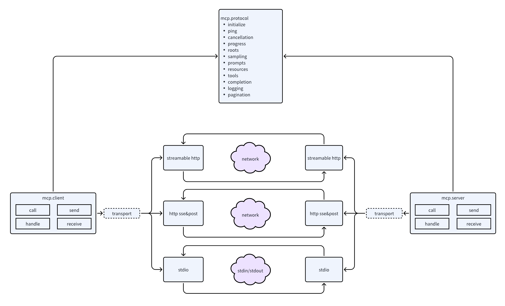
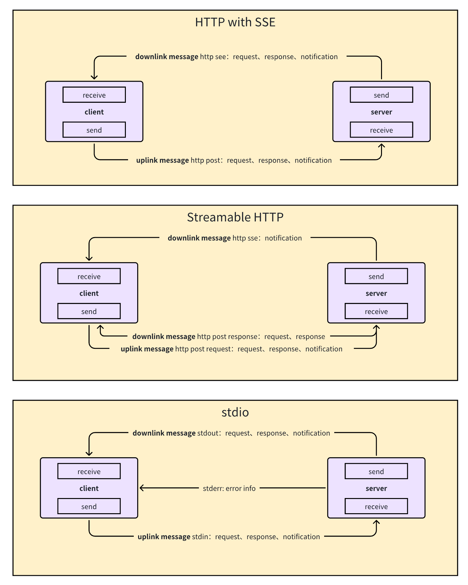

# Go-MCP

<div align="center">

</div>
<br/>

<p align="center">
  <a href="https://github.com/ThinkInAIXYZ/go-mcp/releases"></a>
  <a href="https://github.com/ThinkInAIXYZ/go-mcp/stargazers"></a>
  <a href="https://github.com/ThinkInAIXYZ/go-mcp/network/members"></a>
  <a href="https://github.com/ThinkInAIXYZ/go-mcp/issues"></a>
  <a href="https://github.com/ThinkInAIXYZ/go-mcp/pulls"></a>
  <a href="https://github.com/ThinkInAIXYZ/go-mcp/blob/main/LICENSE"></a>
  <a href="https://github.com/ThinkInAIXYZ/go-mcp/graphs/contributors"></a>
  <a href="https://github.com/ThinkInAIXYZ/go-mcp/commits"></a>
</p>
<p align="center">
  <a href="https://pkg.go.dev/github.com/ThinkInAIXYZ/go-mcp"></a>
  <a href="https://goreportcard.com/report/github.com/ThinkInAIXYZ/go-mcp"></a>
  <a href="https://github.com/ThinkInAIXYZ/go-mcp/actions"></a>
</p>

<p align="center">
  <a href="README.md">English</a>
</p>

## 🚀 Tổng quan

Go-MCP là phiên bản Go mạnh mẽ của MCP SDK, triển khai Model Context Protocol (MCP) để tạo điều kiện giao tiếp liền mạch giữa các hệ thống bên ngoài và ứng dụng AI. Dựa trên những ưu điểm về kiểu dữ liệu mạnh và hiệu năng của ngôn ngữ Go, nó cung cấp API ngắn gọn và phù hợp để giúp bạn tích hợp các hệ thống bên ngoài vào ứng dụng AI.

### ✨ Tính năng chính

- 🔄 **Triển khai giao thức đầy đủ**: Triển khai đầy đủ đặc tả MCP, đảm bảo tích hợp liền mạch với tất cả dịch vụ tương thích
- 🏗️ **Thiết kế kiến trúc**: Áp dụng kiến trúc ba tầng rõ ràng, hỗ trợ giao tiếp hai chiều, đảm bảo tính module hóa và khả năng mở rộng của mã
- 🔌 **Tích hợp liền mạch với các Framework Web**: Cung cấp http.Handler tuân thủ giao thức MCP, cho phép nhà phát triển tích hợp MCP vào framework dịch vụ của họ
- 🛡️ **An toàn kiểu**: Tận dụng hệ thống kiểu mạnh của Go để có mã nguồn rõ ràng, dễ bảo trì
- 📦 **Triển khai đơn giản**: Tận dụng khả năng biên dịch tĩnh của Go, loại bỏ việc quản lý phụ thuộc phức tạp
- ⚡ **Thiết kế hiệu năng cao**: Tận dụng tối đa khả năng xử lý đồng thời của Go, duy trì hiệu năng xuất sắc và tài nguyên thấp trong nhiều tình huống

## 🛠️ Cài đặt
Yêu cầu Go 1.18 trở lên.

## 🎯 Quick Start

### Client Example

```go
package main

import (
	"context"
	"log"

	"github.com/ThinkInAIXYZ/go-mcp/client"
	"github.com/ThinkInAIXYZ/go-mcp/transport"
)

func main() {
	// Create SSE transport client
	transportClient, err := transport.NewSSEClientTransport("http://127.0.0.1:8080/sse")
	if err != nil {
		log.Fatalf("Failed to create transport client: %v", err)
	}

	// Initialize MCP client
	mcpClient, err := client.NewClient(transportClient)
	if err != nil {
		log.Fatalf("Failed to create MCP client: %v", err)
	}
	defer mcpClient.Close()

	// Get available tools
	tools, err := mcpClient.ListTools(context.Background())
	if err != nil {
		log.Fatalf("Failed to list tools: %v", err)
	}
	log.Printf("Available tools: %+v", tools)
}
```

### Server Example

```go
package main

import (
	"context"
	"fmt"
	"log"
	"time"

	"github.com/ThinkInAIXYZ/go-mcp/protocol"
	"github.com/ThinkInAIXYZ/go-mcp/server"
	"github.com/ThinkInAIXYZ/go-mcp/transport"
)

type TimeRequest struct {
	Timezone string `json:"timezone" description:"timezone" required:"true"` // Use field tag to describe input schema
}

func main() {
	// Create SSE transport server
	transportServer, err := transport.NewSSEServerTransport("127.0.0.1:8080")
	if err != nil {
		log.Fatalf("Failed to create transport server: %v", err)
	}

	// Initialize MCP server
	mcpServer, err := server.NewServer(transportServer)
	if err != nil {
		log.Fatalf("Failed to create MCP server: %v", err)
	}

	// Register time query tool
	tool, err := protocol.NewTool("current_time", "Get current time for specified timezone", TimeRequest{})
	if err != nil {
		log.Fatalf("Failed to create tool: %v", err)
		return
	}
	mcpServer.RegisterTool(tool, handleTimeRequest)

	// Start server
	if err = mcpServer.Run(); err != nil {
		log.Fatalf("Server failed to start: %v", err)
	}
}

func handleTimeRequest(ctx context.Context, req *protocol.CallToolRequest) (*protocol.CallToolResult, error) {
	var timeReq TimeRequest
	if err := protocol.VerifyAndUnmarshal(req.RawArguments, &timeReq); err != nil {
		return nil, err
	}

	loc, err := time.LoadLocation(timeReq.Timezone)
	if err != nil {
		return nil, fmt.Errorf("invalid timezone: %v", err)
	}

	return &protocol.CallToolResult{
		Content: []protocol.Content{
			&protocol.TextContent{
				Type: "text",
				Text: time.Now().In(loc).String(),
			},
		},
	}, nil
}
```

### Integration With Gin Server

```go
package main

import (
	"context"
	"log"

	"github.com/ThinkInAIXYZ/go-mcp/protocol"
	"github.com/ThinkInAIXYZ/go-mcp/server"
	"github.com/ThinkInAIXYZ/go-mcp/transport"
	"github.com/gin-gonic/gin"
)

func main() {
	messageEndpointURL := "/message"

	sseTransport, mcpHandler, err := transport.NewSSEServerTransportAndHandler(messageEndpointURL)
	if err != nil {
		log.Panicf("new sse transport and hander with error: %v", err)
	}

	// new mcp server
	mcpServer, _ := server.NewServer(sseTransport)

	// register tool with mcpServer
	// mcpServer.RegisterTool(tool, toolHandler)

	// start mcp Server
	go func() {
		mcpServer.Run()
	}()

	defer mcpServer.Shutdown(context.Background())

	r := gin.Default()
	r.GET("/sse", func(ctx *gin.Context) {
		mcpHandler.HandleSSE().ServeHTTP(ctx.Writer, ctx.Request)
	})
	r.POST(messageEndpointURL, func(ctx *gin.Context) {
		mcpHandler.HandleMessage().ServeHTTP(ctx.Writer, ctx.Request)
	})

	if err = r.Run(":8080"); err != nil {
		return
	}
}
```

[Reference：A more complete example](https://github.com/ThinkInAIXYZ/go-mcp/blob/main/examples/http_handler/main.go)

## 🏗️ Thiết kế kiến trúc

Go-MCP áp dụng kiến trúc ba tầng:



1. **Tầng Vận chuyển**: Xử lý triển khai giao tiếp cơ bản, hỗ trợ nhiều giao thức vận chuyển
2. **Tầng Giao thức**: Xử lý mã hóa/giải mã giao thức MCP và định nghĩa cấu trúc dữ liệu
3. **Tầng Người dùng**: Cung cấp API thân thiện cho máy khách và máy chủ

Các phương thức vận chuyển hiện được hỗ trợ:



- **HTTP SSE/POST**: Đẩy từ máy chủ và yêu cầu từ máy khách dựa trên HTTP, phù hợp cho các tình huống web
- **HTTP có khả năng stream**: Hỗ trợ yêu cầu HTTP POST/GET với cả chế độ stateless và stateful, trong đó chế độ stateful sử dụng SSE để streaming nhiều tin nhắn để kích hoạt thông báo và yêu cầu từ máy chủ đến máy khách
- **Stdio**: Dựa trên luồng input/output chuẩn, phù hợp cho giao tiếp giữa các tiến trình cục bộ

Tầng vận chuyển sử dụng trừu tượng giao diện thống nhất, giúp dễ dàng thêm phương thức vận chuyển mới (như Streamable HTTP, WebSocket, gRPC) mà không ảnh hưởng đến mã tầng trên.

## 🤝 Đóng góp

Chúng tôi hoan nghênh mọi hình thức đóng góp! Vui lòng xem [CONTRIBUTING.md](CONTRIBUTING.md) để biết chi tiết.

## 📄 Giấy phép

Dự án này được cấp phép theo Giấy phép MIT - xem tệp [LICENSE](LICENSE) để biết chi tiết.

## 📞 Liên hệ với chúng tôi

- **GitHub Issues**: [Gửi vấn đề](https://github.com/ThinkInAIXYZ/go-mcp/issues)
- **Discord**: Nhấp [vào đây](https://discord.gg/4CSU8HYt) để tham gia nhóm người dùng của chúng tôi
- **Nhóm WeChat**:


## ✨ Người đóng góp

Cảm ơn tất cả các nhà phát triển đã đóng góp cho dự án này!

<a href="https://github.com/ThinkInAIXYZ/go-mcp/graphs/contributors">
  
</a>

## 📈 Xu hướng dự án

[](https://www.star-history.com/#ThinkInAIXYZ/go-mcp&Date)
